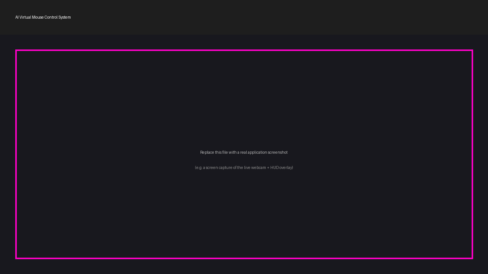

<div align="center">

# 🖱️ AI Virtual Mouse Control System

### Control your computer's mouse cursor using only hand gestures, in real time — powered by Computer Vision and AI.


</div>

---

## 📌 Overview

**AI Virtual Mouse Control System** is a real-time, gesture-controlled mouse
built entirely with computer vision — no external hardware required beyond a
standard webcam. It uses **Google's MediaPipe Hands** model to track 21
hand landmarks per frame, a custom **gesture recognition engine** to
interpret those landmarks as intentional mouse actions, and **PyAutoGUI**
to drive the operating system cursor.

This project was built as a portfolio piece for an **AI & Machine Learning
diploma**, with an emphasis on clean architecture, modular design, and
production-style engineering practices rather than a quick single-file
script.

> 💡 Wave goodbye to your physical mouse — move, click, drag, and scroll
> using nothing but your hand in front of the camera.

---

## ✨ Features

| Feature | Description |
|---|---|
| 🖐️ **Real-time hand tracking** | 21-point hand landmark detection via MediaPipe, running live from webcam input |
| 🎯 **Smooth cursor movement** | Exponential Moving Average (EMA) smoothing eliminates jitter for fluid motion |
| 👆 **Left click gesture** | Pinch index + middle fingertips together |
| ✌️ **Right click gesture** | Pinch middle + ring fingertips while three fingers are raised |
| 🤏 **Double click gesture** | Thumb + index pinch |
| ✊ **Drag & drop gesture** | Close your fist to grab, move to drag, open to release |
| 🔃 **Scroll up / down** | Raise four fingers (no thumb) and move your hand vertically |
| 🎚️ **Adjustable sensitivity** | Fine-tune cursor speed and responsiveness via a single config file |
| 🪄 **Anti-jitter smoothing** | Reduces natural hand tremor from translating into cursor shake |
| 📊 **Live FPS counter** | On-screen, smoothed real-time frame rate |
| 📷 **Webcam status indicator** | Visual ONLINE/OFFLINE indicator with automatic recovery on frame-read failure |
| 🎯 **Detection confidence display** | Live MediaPipe hand-detection confidence score |
| ⌨️ **Safe exit shortcut** | Press `Q` or `ESC` to shut down cleanly at any time |
| 🛡️ **Robust error handling** | Graceful handling of missing cameras, dropped frames, and runtime errors |
| 🚫 **Accidental click prevention** | Frame-based gesture debouncing + click cooldown timers |

---

## 🛠️ Technologies Used

- **Python 3.12+**
- **[OpenCV](https://opencv.org/)** — video capture, image processing, on-screen UI rendering
- **[MediaPipe](https://developers.google.com/mediapipe)** — real-time hand landmark detection
- **[PyAutoGUI](https://pyautogui.readthedocs.io/)** — programmatic OS-level mouse control
- **[NumPy](https://numpy.org/)** — numerical operations and coordinate math

---

## 📂 Folder Structure

```
AI-Virtual-Mouse-Control/
│
├── main.py                    # Application entry point / main loop
├── requirements.txt           # Python dependencies
├── README.md                  # Project documentation (this file)
├── LICENSE                    # MIT License
├── .gitignore                 # Git ignore rules
│
├── assets/
│   ├── demo.png                # Screenshot placeholder
│   └── logo.png                # Project logo placeholder
│
├── config/
│   ├── __init__.py
│   └── settings.py             # Centralized, tunable configuration
│
├── src/
│   ├── __init__.py
│   ├── hand_tracker.py         # MediaPipe hand detection wrapper
│   ├── mouse_controller.py     # Cursor mapping, smoothing & OS mouse control
│   ├── gesture_detector.py     # Gesture recognition state machine
│   ├── utils.py                # Geometry helpers & HUD drawing functions
│   └── fps.py                  # FPS counter utility
│
└── docs/
    └── project_report.md       # Detailed technical project report
```

---

## ⚙️ Installation

### 1. Clone the repository

```bash
git clone https://github.com/<your-username>/AI-Virtual-Mouse-Control.git
cd AI-Virtual-Mouse-Control
```

### 2. Create a virtual environment (recommended)

```bash
python -m venv venv

# Windows
venv\Scripts\activate

# macOS / Linux
source venv/bin/activate
```

### 3. Install dependencies

```bash
pip install -r requirements.txt
```

### 4. Run the application

```bash
python main.py
```

Press **`Q`** or **`ESC`** in the video window at any time to exit safely.

---

## 🎮 Usage — Gesture Guide

| Gesture | Action |
|---|---|
| ☝️ Index finger raised only | Move the cursor |
| 🤏 Index + middle fingers pinched | Left click |
| ✌️➕ Index, middle & ring raised, middle+ring pinched | Right click |
| 🤏 Thumb + index pinched | Double click |
| ✊ Closed fist, then move hand | Drag and drop (release by opening the fist) |
| 🖐️ Four fingers raised (no thumb), move hand up/down | Scroll up / scroll down |

All thresholds (click distance, cooldown timers, smoothing factor,
sensitivity, etc.) can be tuned in **`config/settings.py`** without
touching any application logic.

---

## 🖼️ Screenshots

> Replace the placeholder image below with an actual screen capture of the
> application running (webcam feed + hand landmarks + HUD overlay).

<div align="center">
  
</div>

---

## 🚀 Future Improvements

- 🧠 Add a lightweight ML classifier trained on custom gesture datasets for more robust recognition beyond geometric heuristics
- 🖥️ Multi-monitor support with automatic screen detection
- 🎛️ On-screen GUI (e.g. PyQt/Tkinter) for live sensitivity/smoothing adjustment instead of editing config files
- ✋ Two-hand support for advanced gestures (e.g. zoom, rotate)
- 🔊 Voice command hybrid mode for accessibility use cases
- 📈 Gesture accuracy logging and analytics dashboard
- 🧪 Automated unit tests with `pytest` and CI pipeline via GitHub Actions
- 📦 Packaging as a standalone executable (PyInstaller) for non-technical users
- ♿ Accessibility-focused calibration mode for users with limited hand mobility

---

## 📄 License

This project is licensed under the **MIT License** — see the [LICENSE](LICENSE) file for details.

---

## 👤 Author

**[Your Name]**
AI & Machine Learning Diploma Student

- GitHub: [@your-username](https://github.com/your-username)
- LinkedIn: [your-linkedin-profile](https://linkedin.com/in/your-profile)
- Email: your.email@example.com

---

<div align="center">

⭐ If you found this project useful, consider giving it a star on GitHub!

</div>
